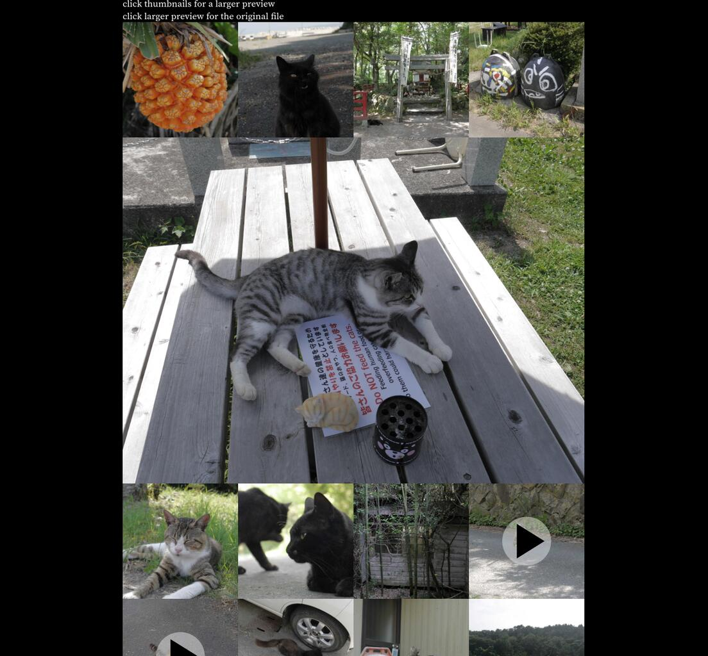

I needed a simple gallery thing that spits out unaltered, uncompressed, zoomable original photos/videos without too much hassle, and got miffed at imgur and friends for being a pain in the arse to use.

With JS enabled (entirely optional) you get a larger in-line preview for image files as well, but otherwise just click on a thumbnail and you'll get a big file beamed directly into your eyeballs.

Looks something like this:

